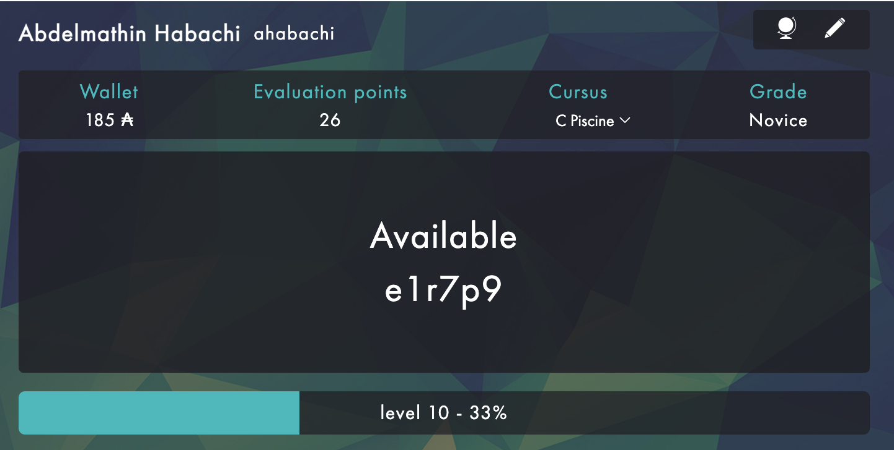

# 42piscine-c
In one month, the Pool of 42 allows you to discover all the learning methods of the training: learning between peers, group work, evaluation by peers or pedagogy by project. Diving into the work methods of 42 students.

# WHAT IS THE PISCINE AT 42?
The highlight of the selection at 42 is the Piscine.

You don’t have to know how to code to apply to the Piscine at 42. Whatever your starting level is, the idea is to test the candidates’ involvement capacity during the Piscine at 42. Rather than offering a straight computer initiation, the Piscine at 42 lets you start the curriculum with intensive training in C, the first language you have to use during the training course. For one month, the Piscine at 42 lets you tackle the teaching methods of the school: peer-to-peer learning, group work, peer-evaluation and project pedagogy.

# Abdelmathin Habachi (ranked third)

# Contents

* Day 00

$~~~~~~~~$[C Piscine C00 Exercise 00 : ft_putchar](https://github.com/Abdelmathin/42piscine-c/tree/main/C00/ex00)

$~~~~~~~~$[C Piscine C00 Exercise 01 : ft_print_alphabet](https://github.com/Abdelmathin/42piscine-c/tree/main/C00/ex01)

$~~~~~~~~$[C Piscine C00 Exercise 02 : ft_print_reverse_alphabet](https://github.com/Abdelmathin/42piscine-c/tree/main/C00/ex02)

$~~~~~~~~$[C Piscine C00 Exercise 03 : ft_print_numbers](https://github.com/Abdelmathin/42piscine-c/tree/main/C00/ex03)

$~~~~~~~~$[C Piscine C00 Exercise 04 : ft_is_negative](https://github.com/Abdelmathin/42piscine-c/tree/main/C00/ex04)

$~~~~~~~~$[C Piscine C00 Exercise 05 : ft_print_comb](https://github.com/Abdelmathin/42piscine-c/tree/main/C00/ex05)

$~~~~~~~~$[C Piscine C00 Exercise 06 : ft_print_comb2](https://github.com/Abdelmathin/42piscine-c/tree/main/C00/ex06)

$~~~~~~~~$[C Piscine C00 Exercise 07 : ft_putnbr](https://github.com/Abdelmathin/42piscine-c/tree/main/C00/ex07)

$~~~~~~~~$[C Piscine C00 Exercise 08 : ft_print_combn](https://github.com/Abdelmathin/42piscine-c/tree/main/C00/ex08)

* Day 00

$~~~~~~~~$[C Piscine C01 Exercise 00 : ft_ft](https://github.com/Abdelmathin/42piscine-c/tree/main/C01/ex00)

$~~~~~~~~$[C Piscine C01 Exercise 01 : ft_ultimate_ft](https://github.com/Abdelmathin/42piscine-c/tree/main/C01/ex01)

$~~~~~~~~$[C Piscine C01 Exercise 02 : ft_swap](https://github.com/Abdelmathin/42piscine-c/tree/main/C01/ex02)

$~~~~~~~~$[C Piscine C01 Exercise 03 : ft_div_mod](https://github.com/Abdelmathin/42piscine-c/tree/main/C01/ex03)

$~~~~~~~~$[C Piscine C01 Exercise 04 : ft_ultimate_div_mod](https://github.com/Abdelmathin/42piscine-c/tree/main/C01/ex04)

$~~~~~~~~$[C Piscine C01 Exercise 05 : ft_putstr](https://github.com/Abdelmathin/42piscine-c/tree/main/C01/ex05)

$~~~~~~~~$[C Piscine C01 Exercise 06 : ft_strlen](https://github.com/Abdelmathin/42piscine-c/tree/main/C01/ex06)

$~~~~~~~~$[C Piscine C01 Exercise 07 : ft_rev_int_tab](https://github.com/Abdelmathin/42piscine-c/tree/main/C01/ex07)

$~~~~~~~~$[C Piscine C01 Exercise 08 : ft_sort_int_tab](https://github.com/Abdelmathin/42piscine-c/tree/main/C01/ex08)

* Day 00

$~~~~~~~~$[C Piscine C02 Exercise 00 : ft_strcpy](https://github.com/Abdelmathin/42piscine-c/tree/main/C02/ex00)

$~~~~~~~~$[C Piscine C02 Exercise 01 : ft_strncpy](https://github.com/Abdelmathin/42piscine-c/tree/main/C02/ex01)

$~~~~~~~~$[C Piscine C02 Exercise 02 : ft_str_is_alpha](https://github.com/Abdelmathin/42piscine-c/tree/main/C02/ex02)

$~~~~~~~~$[C Piscine C02 Exercise 03 : ft_str_is_numeric](https://github.com/Abdelmathin/42piscine-c/tree/main/C02/ex03)

$~~~~~~~~$[C Piscine C02 Exercise 04 : ft_str_is_lowercase](https://github.com/Abdelmathin/42piscine-c/tree/main/C02/ex04)

$~~~~~~~~$[C Piscine C02 Exercise 05 : ft_str_is_uppercase](https://github.com/Abdelmathin/42piscine-c/tree/main/C02/ex05)

$~~~~~~~~$[C Piscine C02 Exercise 06 : ft_str_is_printable](https://github.com/Abdelmathin/42piscine-c/tree/main/C02/ex06)

$~~~~~~~~$[C Piscine C02 Exercise 07 : ft_strupcase](https://github.com/Abdelmathin/42piscine-c/tree/main/C02/ex07)

$~~~~~~~~$[C Piscine C02 Exercise 08 : ft_strlowcase](https://github.com/Abdelmathin/42piscine-c/tree/main/C02/ex08)

$~~~~~~~~$[C Piscine C02 Exercise 09 : ft_strcapitalize](https://github.com/Abdelmathin/42piscine-c/tree/main/C02/ex09)

$~~~~~~~~$[C Piscine C02 Exercise 10 : ft_strlcpy](https://github.com/Abdelmathin/42piscine-c/tree/main/C02/ex10)

$~~~~~~~~$[C Piscine C02 Exercise 11 : ft_putstr_non_printable](https://github.com/Abdelmathin/42piscine-c/tree/main/C02/ex11)

$~~~~~~~~$[C Piscine C02 Exercise 12 : ft_print_memory](https://github.com/Abdelmathin/42piscine-c/tree/main/C02/ex12)

* Day 00

$~~~~~~~~$[C Piscine C03 Exercise 00 : ft_strcmp](https://github.com/Abdelmathin/42piscine-c/tree/main/C03/ex00)

$~~~~~~~~$[C Piscine C03 Exercise 01 : ft_strncmp](https://github.com/Abdelmathin/42piscine-c/tree/main/C03/ex01)

$~~~~~~~~$[C Piscine C03 Exercise 02 : ft_strcat](https://github.com/Abdelmathin/42piscine-c/tree/main/C03/ex02)

$~~~~~~~~$[C Piscine C03 Exercise 03 : ft_strncat](https://github.com/Abdelmathin/42piscine-c/tree/main/C03/ex03)

$~~~~~~~~$[C Piscine C03 Exercise 04 : ft_strstr](https://github.com/Abdelmathin/42piscine-c/tree/main/C03/ex04)

$~~~~~~~~$[C Piscine C03 Exercise 05 : ft_strlcat](https://github.com/Abdelmathin/42piscine-c/tree/main/C03/ex05)

$~~~~~~~~$[C Piscine C04 Exercise 00 : ft_strlen](https://github.com/Abdelmathin/42piscine-c/tree/main/C04/ex00)

$~~~~~~~~$[C Piscine C04 Exercise 01 : ft_putstr](https://github.com/Abdelmathin/42piscine-c/tree/main/C04/ex01)

$~~~~~~~~$[C Piscine C04 Exercise 02 : ft_putnbr](https://github.com/Abdelmathin/42piscine-c/tree/main/C04/ex02)

$~~~~~~~~$[C Piscine C04 Exercise 03 : ft_atoi](https://github.com/Abdelmathin/42piscine-c/tree/main/C04/ex03)

$~~~~~~~~$[C Piscine C04 Exercise 04 : ft_putnbr_base](https://github.com/Abdelmathin/42piscine-c/tree/main/C04/ex04)

$~~~~~~~~$[C Piscine C04 Exercise 05 : ft_atoi_base](https://github.com/Abdelmathin/42piscine-c/tree/main/C04/ex05)

* Day 00

$~~~~~~~~$[C Piscine C05 Exercise 00 : ft_iterative_factorial](https://github.com/Abdelmathin/42piscine-c/tree/main/C05/ex00)

$~~~~~~~~$[C Piscine C05 Exercise 01 : ft_recursive_factorial](https://github.com/Abdelmathin/42piscine-c/tree/main/C05/ex01)

$~~~~~~~~$[C Piscine C05 Exercise 02 : ft_iterative_power](https://github.com/Abdelmathin/42piscine-c/tree/main/C05/ex02)

$~~~~~~~~$[C Piscine C05 Exercise 03 : ft_recursive_power](https://github.com/Abdelmathin/42piscine-c/tree/main/C05/ex03)

$~~~~~~~~$[C Piscine C05 Exercise 04 : ft_fibonacci](https://github.com/Abdelmathin/42piscine-c/tree/main/C05/ex04)

$~~~~~~~~$[C Piscine C05 Exercise 05 : ft_sqrt](https://github.com/Abdelmathin/42piscine-c/tree/main/C05/ex05)

$~~~~~~~~$[C Piscine C05 Exercise 06 : ft_is_prime](https://github.com/Abdelmathin/42piscine-c/tree/main/C05/ex06)

$~~~~~~~~$[C Piscine C05 Exercise 07 : ft_find_next_prime](https://github.com/Abdelmathin/42piscine-c/tree/main/C05/ex07)

$~~~~~~~~$[C Piscine C05 Exercise 08 : ft_ten_queens_puzzle](https://github.com/Abdelmathin/42piscine-c/tree/main/C05/ex08)

* Day 00

$~~~~~~~~$[C Piscine C06 Exercise 00 : ft_print_program_name](https://github.com/Abdelmathin/42piscine-c/tree/main/C06/ex00)

$~~~~~~~~$[C Piscine C06 Exercise 01 : ft_print_params](https://github.com/Abdelmathin/42piscine-c/tree/main/C06/ex01)

$~~~~~~~~$[C Piscine C06 Exercise 02 : ft_rev_params](https://github.com/Abdelmathin/42piscine-c/tree/main/C06/ex02)

$~~~~~~~~$[C Piscine C06 Exercise 03 : ft_sort_params](https://github.com/Abdelmathin/42piscine-c/tree/main/C06/ex03)

* Day 00

$~~~~~~~~$[C Piscine C07 Exercise 00 : ft_strdup](https://github.com/Abdelmathin/42piscine-c/tree/main/C07/ex00)

$~~~~~~~~$[C Piscine C07 Exercise 01 : ft_range](https://github.com/Abdelmathin/42piscine-c/tree/main/C07/ex01)

$~~~~~~~~$[C Piscine C07 Exercise 02 : ft_ultimate_range](https://github.com/Abdelmathin/42piscine-c/tree/main/C07/ex02)

$~~~~~~~~$[C Piscine C07 Exercise 03 : ft_strjoin](https://github.com/Abdelmathin/42piscine-c/tree/main/C07/ex03)

$~~~~~~~~$[C Piscine C07 Exercise 04 : ft_convert_base](https://github.com/Abdelmathin/42piscine-c/tree/main/C07/ex04)

$~~~~~~~~$[C Piscine C07 Exercise 04 : ft_convert_base2](https://github.com/Abdelmathin/42piscine-c/tree/main/C07/ex04)

$~~~~~~~~$[C Piscine C07 Exercise 05 : ft_split](https://github.com/Abdelmathin/42piscine-c/tree/main/C07/ex05)

$~~~~~~~~$[C Piscine C08 Exercise 04 : ft_strs_to_tab](https://github.com/Abdelmathin/42piscine-c/tree/main/C08/ex04)

$~~~~~~~~$[C Piscine C08 Exercise 05 : ft_show_tab](https://github.com/Abdelmathin/42piscine-c/tree/main/C08/ex05)

$~~~~~~~~$[C Piscine C09 Exercise 00 : ft_putchar](https://github.com/Abdelmathin/42piscine-c/tree/main/C09/ex00)

$~~~~~~~~$[C Piscine C09 Exercise 00 : ft_putstr](https://github.com/Abdelmathin/42piscine-c/tree/main/C09/ex00)

$~~~~~~~~$[C Piscine C09 Exercise 00 : ft_strcmp](https://github.com/Abdelmathin/42piscine-c/tree/main/C09/ex00)

$~~~~~~~~$[C Piscine C09 Exercise 00 : ft_strlen](https://github.com/Abdelmathin/42piscine-c/tree/main/C09/ex00)

$~~~~~~~~$[C Piscine C09 Exercise 00 : ft_swap](https://github.com/Abdelmathin/42piscine-c/tree/main/C09/ex00)

$~~~~~~~~$[C Piscine C09 Exercise 02 : ft_split](https://github.com/Abdelmathin/42piscine-c/tree/main/C09/ex02)

[Finished in 44ms]
